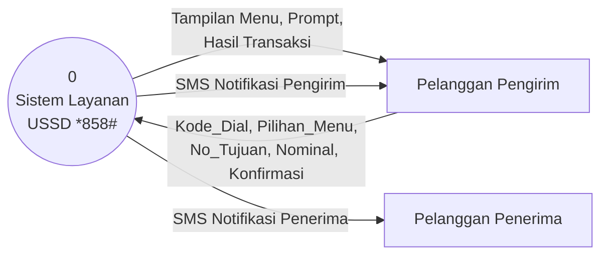
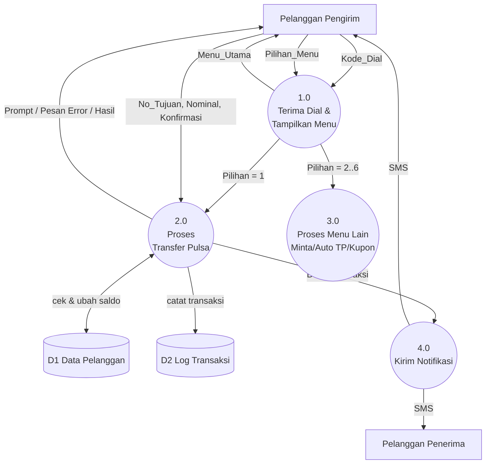
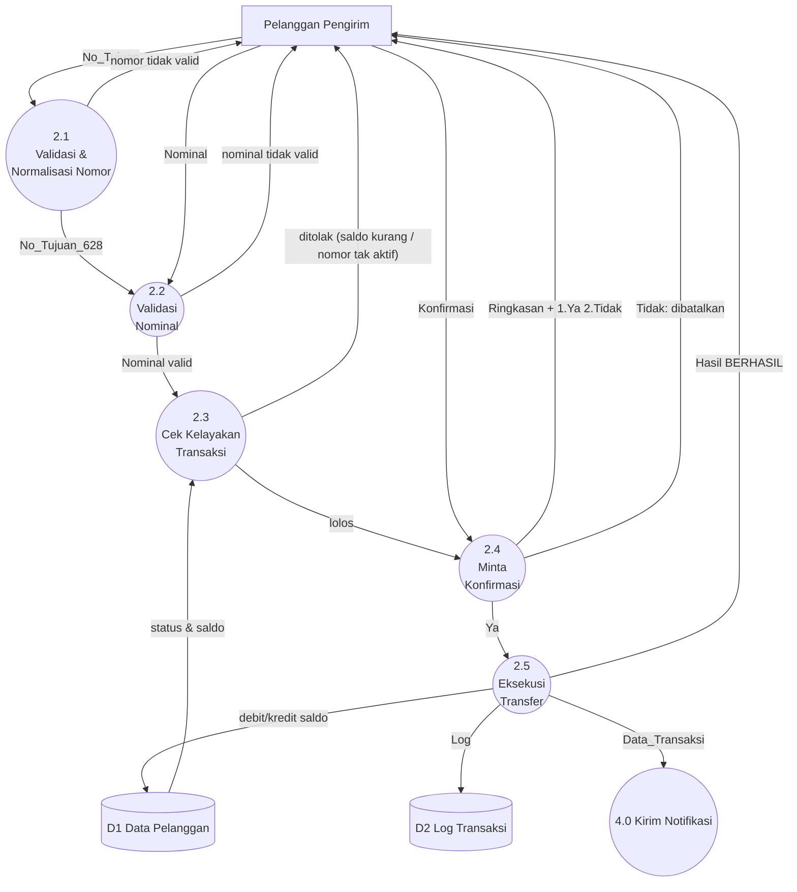

# Analisis Layanan USSD *858# — DFD, PSPEC, dan Kode

> Sumber: slide tugas (menu utama *858#: 1 Transfer Pulsa, 2 Minta Pulsa, 3 Auto TP, 4 Delete Auto TP, 5 List Auto TP, 6 Cek Kupon Undian TP).
> Menu 1 meminta nomor tujuan (08xxxx / 628xxxx), lalu lanjut ke eksekusi dan notifikasi berhasil.
> Langkah **nominal** dan **konfirmasi** serta aturan bisnis (min/maks, biaya admin) adalah **asumsi** karena tidak ada di slide.

## Kamus Data singkat
| Nama | Isi |
|---|---|
| Kode_Dial | `*858#` |
| Pilihan_Menu | angka 1–6 |
| No_Tujuan | 08xxxx / 628xxxx |
| Nominal | angka rupiah |
| Konfirmasi | 1 = Ya, 2 = Tidak |
| D1 Data_Pelanggan | msisdn, saldo, status aktif |
| D2 Log_Transaksi | id, pengirim, penerima, nominal, biaya, status |

## 1. DFD Level 0 (Diagram Konteks)



## 2. DFD Level 1



## 3. DFD Level 2 — Proses 2.0 Transfer Pulsa



Catatan penyeimbangan (balancing): aliran masuk/keluar Level 2 sama dengan proses 2.0 di Level 1 (No_Tujuan, Nominal, Konfirmasi masuk; Prompt/Error/Hasil keluar; akses D1, D2; keluaran ke 4.0).

---

## 4. PSPEC (Structured English) — jalur: `*858#` → 1 Transfer Pulsa → eksekusi

**P1.0 Terima Dial & Tampilkan Menu**
```
BEGIN
  READ Kode_Dial
  IF Kode_Dial = "*858#" THEN
     DISPLAY Menu_Utama (1..6)
     READ Pilihan_Menu
     IF Pilihan_Menu = 1 THEN CALL P2.0
     ELSE IF Pilihan_Menu IN (2,3,4,5,6) THEN CALL P3.0
     ELSE DISPLAY "Pilihan salah"; END SESSION
  ELSE
     DISPLAY "Kode USSD tidak dikenal"; END SESSION
  ENDIF
END
```

**P2.1 Validasi & Normalisasi Nomor**
```
READ No_Tujuan
IF No_Tujuan MATCHES (08 + 8..11 digit) OR (628 + 8..11 digit) THEN
   IF No_Tujuan diawali "0" THEN No_Tujuan := "62" + No_Tujuan tanpa digit pertama
   PASS No_Tujuan ke P2.2
ELSE
   DISPLAY "Nomor tidak valid"; ULANGI input nomor
ENDIF
```

**P2.2 Validasi Nominal**
```
READ Nominal
IF Nominal bukan angka THEN DISPLAY "Nominal harus angka"; ULANGI
ELSE IF Nominal < 5.000 THEN DISPLAY "Minimum Rp5.000"; ULANGI
ELSE IF Nominal > 100.000 THEN DISPLAY "Maksimum Rp100.000"; ULANGI
ELSE PASS Nominal ke P2.3
```

**P2.3 Cek Kelayakan Transaksi**
```
READ Data_Pelanggan (pengirim, penerima) dari D1
IF No_Tujuan = No_Pengirim THEN REJECT "Tidak dapat transfer ke nomor sendiri"
ELSE IF penerima tidak terdaftar OR tidak aktif THEN REJECT "Nomor tujuan tidak aktif"
ELSE IF Saldo_Pengirim - (Nominal + Biaya_Admin) < 0 THEN REJECT "Pulsa tidak mencukupi"
ELSE PASS ke P2.4
ENDIF
```

**P2.4 Minta Konfirmasi**
```
DISPLAY "Transfer Rp[Nominal] ke [No_Tujuan], biaya Rp[Biaya_Admin]. 1.Ya 2.Tidak"
READ Konfirmasi
IF Konfirmasi = 1 THEN CALL P2.5
ELSE IF Konfirmasi = 2 THEN DISPLAY "Transaksi dibatalkan"; END SESSION
ELSE DISPLAY "Pilihan salah"; ULANGI konfirmasi
```

**P2.5 Eksekusi Transfer**
```
RE-CHECK kelayakan (P2.3)           -- saldo bisa berubah selama sesi
IF lolos THEN
   Saldo_Pengirim  := Saldo_Pengirim - Nominal - Biaya_Admin
   Saldo_Penerima  := Saldo_Penerima + Nominal
   WRITE Log_Transaksi (ID, pengirim, penerima, Nominal, Biaya, "SUCCESS") ke D2
   DISPLAY "Transfer pulsa berhasil. ID: [ID]"
   SEND Data_Transaksi ke P4.0
ELSE
   DISPLAY pesan error; END SESSION
ENDIF
```

**P4.0 Kirim Notifikasi**
```
SEND SMS ke pengirim: "Transfer Rp[Nominal] ke [No_Tujuan] berhasil. Sisa pulsa Rp[Saldo]. ID [ID]"
SEND SMS ke penerima: "Anda menerima pulsa Rp[Nominal] dari [No_Pengirim]. ID [ID]"
```

---

## 5. Kode
Lihat `ussd_858_transfer_pulsa.py` (Python 3, tanpa dependensi). Pemetaan: `dial()` = P1.0, `normalize_msisdn` = P2.1, `validate_amount` = P2.2, `check_eligibility` = P2.3, state `CONFIRM` = P2.4, `execute_transfer` = P2.5 + P4.0.
Untuk dikumpulkan: unggah ke GitHub (`git init`, `git add .`, `git commit`, `git push`).
